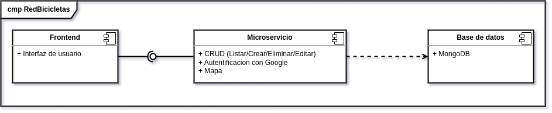
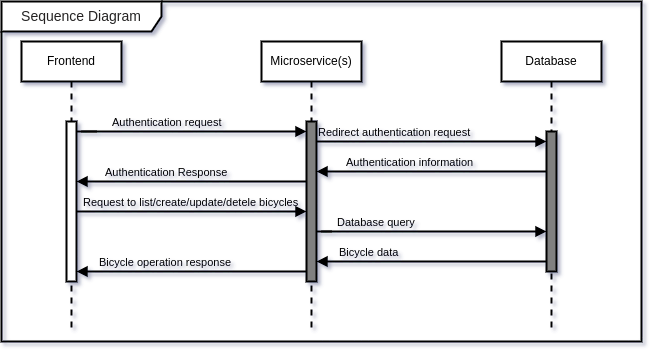
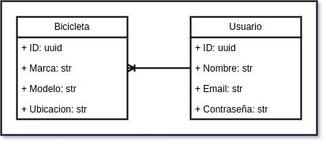
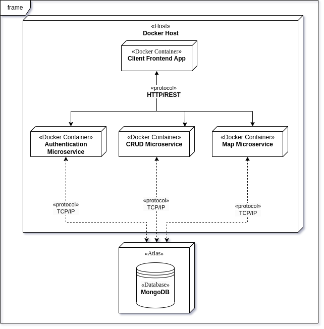

****Arquitectura Caso de Estudio Alquiler y gestión de eventos Bicicletas****
=============================================================================

Clase: Arquitecturas Avanzadas de Software

Estudiante: Antoine Chavane de Dalmassy Córdoba

1.  **Alcance y contexto del sistema:** El sistema es una aplicación de gestión de bicicletas que permite a los usuarios crear, editar, eliminar y listar bicicletas a través de una REST API. Además, se integra con Google para autenticación de usuarios. La aplicación también incluye una función de visualización de bicicletas en un mapa interactivo utilizando LeafletJS.

2.  **Modelo de componentes:** La arquitectura constará de los siguientes componentes:
    
    *   Servicios de microservicios: Se implementarán microservicios para cada una de las funcionalidades del sistema, incluyendo la gestión de bicicletas (crear, editar, eliminar, listar) y la autenticación con Google. Cada microservicio será independiente y estará encapsulado en un contenedor Docker, lo que permitirá su implementación y despliegue de forma independiente y escalable.
    
    *   Base de datos: Se utilizará una base de datos NoSQL, como MongoDB, para almacenar la información de las bicicletas, incluyendo su ubicación geográfica.
    
    *   Frontend: Se desarrollará un frontend que permita a los usuarios interactuar con la aplicación a través de una interfaz de usuario amigable. El frontend se comunicará directamente con los microservicios respectivos para realizar las operaciones CRUD de bicicletas y la autenticación de usuarios, este ultimo tambien siendo un microservicio propio para la autentificacion.

3.  **Diagrama de componentes:** El diagrama de componentes mostrará la estructura de los componentes del sistema y las interacciones entre ellos. Incluirá los microservicios, la base de datos y el frontend, y las relaciones entre ellos.

    

1.  **Diagrama de secuencia:** El diagrama de secuencia mostrará las interacciones entre los componentes del sistema en una secuencia temporal, enfocándose en los flujos de trabajo principales, como la creación, edición, eliminación y listado de bicicletas, y la autenticación con Google.

    
1.  **Diagrama de modelo de entidad:** El diagrama de modelo de entidad mostrará las entidades principales del sistema, como las bicicletas y los usuarios, y las relaciones entre ellas. También mostrará los atributos de las entidades y las restricciones de integridad de datos.

    

1.  **Diagrama de despliegue:** El diagrama de despliegue mostrará la infraestructura de hardware y software necesaria para implementar el sistema en la nube. Incluirá los contenedores Docker de los microservicios, la base de datos NoSQL y otros componentes necesarios para el despliegue del sistema.

    

1.  **Decisiones arquitectónicas:**
    
    *   Utilizar una arquitectura de microservicios para permitir la escalabilidad y la independencia en el desarrollo y despliegue de las funcionalidades del sistema.
    
    *   Por razones de practicidad se decidio no utilizar un API Gateway para el manejo de la exposición de las funcionalidades del sistema y gestion de las peticiones a los microservicios correspondientes.
    
    *   Desde el frontend se gestionara directamente el llamado de peticiones (los request) hacia los microservicios correspondientes.
    
    *   Utilizar una base de datos NoSQL, como MongoDB, para almacenar la información de las bicicletas y su ubicación geográfica.
    
    *   Se propone el uso de una base de datos NoSQL en esta arquitectura debido a varias razones:
        
        *   Escalabilidad horizontal: Las bases de datos NoSQL están diseñadas para manejar grandes volúmenes de datos y escalar horizontalmente de manera eficiente, lo que las hace ideales para aplicaciones con potencial de crecimiento y alta demanda, como una aplicación de bicicletas.
        
        *   Flexibilidad en el esquema de datos: A diferencia de las bases de datos relacionales, las bases de datos NoSQL no tienen un esquema fijo, lo que permite una mayor flexibilidad en la forma en que se almacenan y manejan los datos. Esto es beneficioso en escenarios donde los requisitos de los datos pueden cambiar con el tiempo, lo que es común en aplicaciones en evolución.
        
        *   Alta velocidad en la lectura/escritura: Las bases de datos NoSQL suelen estar optimizadas para operaciones de lectura/escritura rápidas, lo que las hace adecuadas para aplicaciones que requieren un alto rendimiento en el acceso a los datos, como una aplicación de bicicletas que necesita realizar operaciones CRUD de manera eficiente.
        
        *   Integración con tecnologías modernas: Las bases de datos NoSQL suelen tener una buena integración con tecnologías modernas como la nube, microservicios y APIs REST, lo que facilita su uso en arquitecturas Cloud Native y de microservicios.
    
    *   Utilizar contenedores